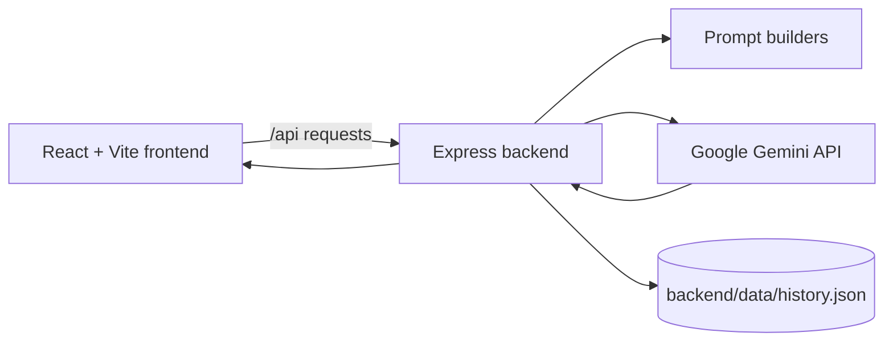

# StudyBuddy AI

StudyBuddy AI is a full-stack study companion for turning lecture notes into useful revision material. Paste your notes once, then use the same notes to generate a concise summary, create a five-question multiple-choice quiz, or ask follow-up doubts in a streaming chat.

The application is built with React and Vite on the frontend and Node.js, Express, and the Google Gemini API on the backend.

## Features

- Paste lecture notes or load the included sample notes.
- Generate a plain-text summary with the main idea, key points, and important terms.
- Generate five multiple-choice questions at easy, medium, or hard difficulty.
- Answer quiz questions one at a time and see the explanation and final score.
- Ask questions about the notes through a streaming AI tutor.
- Save summaries and notes locally so recent study sessions can be reopened.
- Keep API credentials on the server instead of exposing them in the browser.
- Use the Vite development proxy to send `/api` requests to the Express server.

## How It Works

1. The user enters at least 50 characters of lecture notes in the React interface.
2. The frontend sends the notes to the Express API.
3. The backend builds a focused prompt and calls Google Gemini.
4. The result is returned to the frontend as summary JSON, quiz JSON, or a streamed chat response.
5. Successful summaries are written to local JSON storage and appear in the session history.



## Architecture

```text
goodboy/
├── backend/
│   ├── app.js                 Express server and API routes
│   ├── ai.js                  Gemini client, retries, streaming, and errors
│   ├── prompts.js             Summary, quiz, and tutor prompts
│   ├── history.js             Local history read/write helpers
│   ├── data/history.json      Saved sessions, limited to the latest 20
│   ├── package.json
│   └── .env                   Local Gemini configuration, not committed
├── frontend/
│   ├── src/App.jsx            Main application layout
│   ├── src/api.js             Browser API and streaming helpers
│   ├── src/components/        Notes, summary, quiz, chat, and history UI
│   ├── src/App.css             Application styles
│   ├── src/index.css          Global styles
│   ├── vite.config.js         Vite and API proxy configuration
│   └── package.json
└── README.md
```

### Request flow

- `POST /api/summary` generates a summary and saves the session.
- `POST /api/quiz` generates structured quiz data using a JSON schema.
- `POST /api/chat` streams tutor text as it is generated.
- `GET /api/history` loads saved sessions.
- `GET /api/health` confirms that the backend is running.

## Requirements

- Node.js 18 or newer recommended
- npm
- A Google Gemini API key with access to the configured model

## Clone and Install

Clone the repository and enter the project directory:

```bash
git clone https://github.com/adimukkhi/goodboy.git
cd goodboy
```

Install dependencies separately for the two applications:

```bash
cd backend
npm install

cd ../frontend
npm install
```

## Configuration

Create `backend/.env`:

```env
GEMINI_API_KEY=your_gemini_api_key_here
MODEL=gemini-flash-lite-latest
PORT=3001
```

### Configuration values

| Variable | Required | Default | Purpose |
| --- | --- | --- | --- |
| `GEMINI_API_KEY` | Yes | None | Authenticates requests to Google Gemini |
| `MODEL` | No | `gemini-flash-lite-latest` | Gemini model used for summaries, quizzes, and chat |
| `PORT` | No | `3001` | Port used by the Express backend |

Never commit `backend/.env` or share the API key. The backend loads environment variables with `dotenv`.

## Run Locally

Start the backend in one terminal:

```bash
cd backend
npm run dev
```

The backend runs at `http://localhost:3001`.

Start the frontend in a second terminal:

```bash
cd frontend
npm run dev
```

Open the Vite URL shown in the terminal, normally `http://localhost:5173`.

The Vite configuration proxies requests beginning with `/api` to `http://localhost:3001`, so both servers must be running during development.

## Production Build

Build the frontend:

```bash
cd frontend
npm run build
```

The Express server is configured to serve the generated `frontend/dist` directory. Start the backend from the project directory after building:

```bash
cd backend
node app.js
```

Open `http://localhost:3001`. The backend serves the built frontend and its API from the same origin.

## API Reference

All note-based endpoints require a `notes` string containing 50 to 30,000 characters.

### `GET /api/health`

Returns a simple server status response.

### `GET /api/history`

Returns saved sessions from `backend/data/history.json`. Each session contains an ID, title, creation time, original notes, and generated summary. Only the latest 20 summaries are retained.

### `POST /api/summary`

Request:

```json
{
	"notes": "Your lecture notes, at least 50 characters long."
}
```

Response:

```json
{
	"summary": "Generated revision summary"
}
```

### `POST /api/quiz`

Request:

```json
{
	"notes": "Your lecture notes, at least 50 characters long.",
	"difficulty": "medium"
}
```

`difficulty` accepts `easy`, `medium`, or `hard`; unknown values fall back to `medium`.

Response:

```json
{
	"questions": [
		{
			"question": "Question text",
			"options": ["Option A", "Option B", "Option C", "Option D"],
			"answerIndex": 1,
			"explanation": "Why the answer is correct"
		}
	]
}
```

### `POST /api/chat`

Request:

```json
{
	"notes": "Your lecture notes, at least 50 characters long.",
	"messages": [
		{ "role": "user", "content": "What is the main idea?" }
	]
}
```

The response is streamed as plain text. The server accepts `user` and `assistant` messages and uses the most recent 20 valid messages.

## Validation and Error Handling

- Notes shorter than 50 characters are rejected.
- Notes longer than 30,000 characters are rejected.
- Chat requests must end with a user message.
- Gemini transient server errors are retried for non-streaming requests.
- User-friendly messages are returned for missing keys, invalid keys, rate limits, blocked responses, and service failures.
- History is optional at runtime; if the history file is unavailable, the app can still generate new content.

## Available Scripts

### Frontend

| Command | Description |
| --- | --- |
| `npm run dev` | Start the Vite development server |
| `npm run build` | Create a production build in `frontend/dist` |
| `npm run lint` | Run ESLint |
| `npm run preview` | Preview the production build locally |

### Backend

| Command | Description |
| --- | --- |
| `npm run dev` | Start Express with nodemon |
| `node app.js` | Start Express directly |

## Troubleshooting

### The frontend shows a 502 or cannot reach the API

Make sure the backend is running in `backend` and listening on port 3001. Check `http://localhost:3001/api/health`, then restart the frontend if the proxy configuration was changed.

### Gemini reports an API-key error

Confirm that `backend/.env` exists, contains `GEMINI_API_KEY`, and that the backend was restarted after changing it.

### Requests are rate-limited

Wait for the Gemini quota window to reset, or use a project/model with available quota. The backend reports the retry duration when Gemini provides one.

### Saved history is missing

History is stored locally in `backend/data/history.json`. It is not a database and is intended for local use. Check that the backend process has permission to write to the `backend/data` directory.

## Security Notes

- Keep `GEMINI_API_KEY` server-side and out of source control.
- Do not expose the Express server publicly without adding authentication, request limits, and stronger persistence controls.
- User notes are sent to the configured Gemini model to generate the requested study content.

## License

No license has been specified for this project yet.